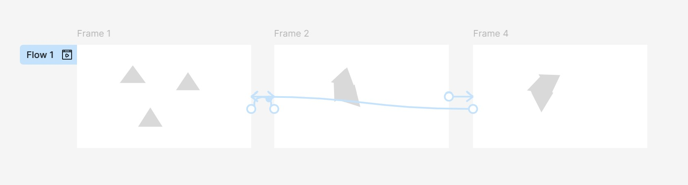
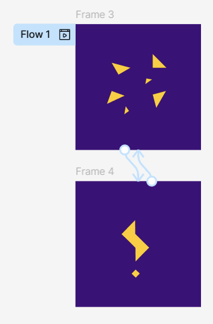
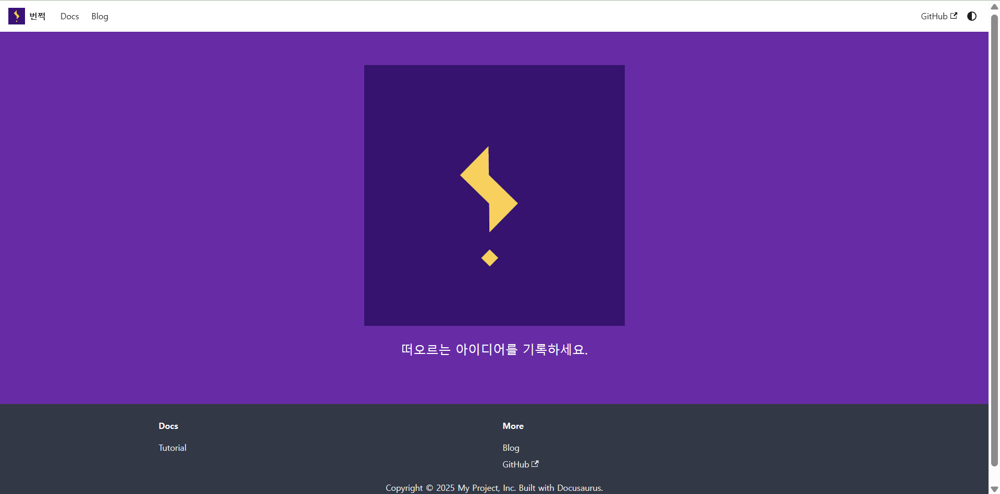
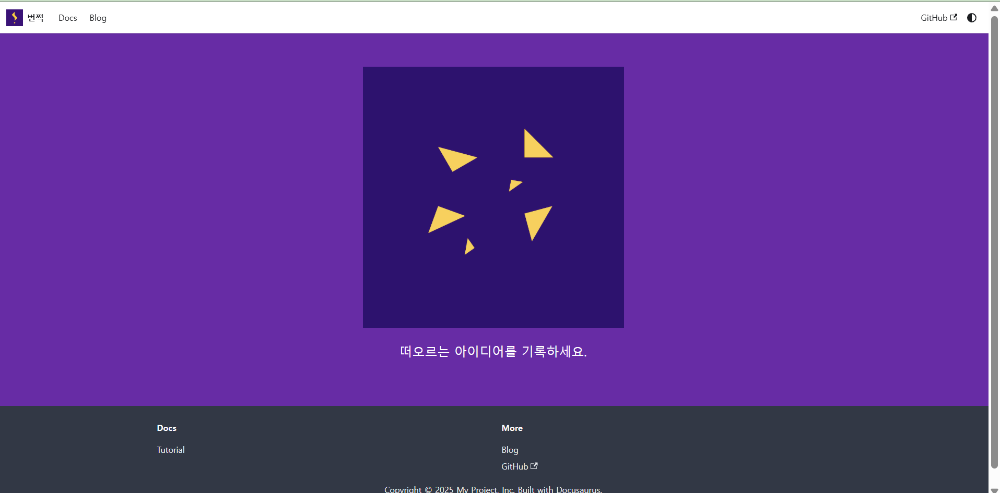

번쩍 애니메이션 아이디어입니다.
번쩍의 로고인 번개모양 느낌표는 6개의 직각 삼각형으로 이루어져있습니다.
이 직각 삼각형들이 흩어졌다가 합쳐지면서 로고 모양으로 변하여 아이디어가 번쩍 떠오르는 걸 연상하는 애니메이션을 구상하고 있습니다.

앱 소개 페이지 첫 부분과 앱 시작 애니메이션으로 적용 예정이며 피그마를 사용하여 제작할 수 있을 것 같습니다.

아래와 같이, 프레임에 도형을 만들고, 프레임 아래 + 버튼을 드래그하여 다른 프레임에 연결하면 애니메이션을 설정할 수 있습니다.

아래는 Animation 속성을 Smart animate, Curve를 Gentle, Duration을 800ms로 설정한 예시입니다.
흔들리는 효과는 Curve에 Bouncy를 사용하였습니다.

간단하게 흩어졌다가 합쳐지는 방식으로 적용해보았습니다.

홈페이지에 다음과 같이 적용했습니다.
다만 PPT를 영상으로 캡쳐하고 gif로 변환하는 방식이다보니 애니메이션이나 색감이 매끄럽지 않은 문제가 있습니다.

