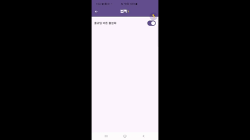

현재 번쩍의 아이디어 입력 플로팅 버튼은 우측 상단에 고정되어있습니다.

이로 인해 사용자가 다른 서비스를 이용할 때 불편함을 겪을 수 있으므로, 버튼을 원하는 위치(좌/우 가장자리 한정)로 이동시킬 수 있게끔 개선하고자 합니다.

먼저 오른쪽에 고정된 상태로, 길게 눌렀을 때 상하로 이동 가능하게 구현해보겠습니다.

플로팅 버튼에는 총 3가지 이벤트에 대한 리스너가 등록됩니다.
1. 클릭 이벤트 (입력 창을 표시하기 위함)
2. 롱클릭 이벤트 (위치 조정 시작을 위함)
3. 터치 이벤트 (위치 감지 및 재설정을 위함)

플로팅 버튼을 길게 누르면 상하로 드래그하여 위치를 조정할 수 있습니다.

